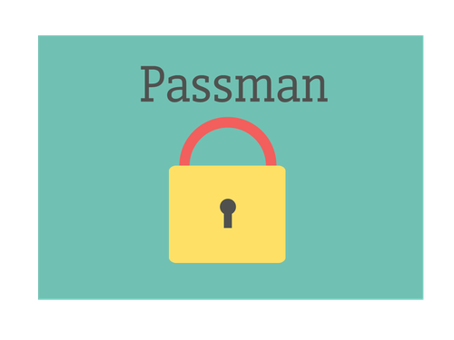

Passman is a password management application that allows for password generation, storage, retrieval, updates, and removal from the comfort of the command line.

Passman was written by:

[Sam Messina](https://github.com/regexpressyourself)

[Dan Jensen](https://github.com/nosnixster)

## Installing

Passman is pip-installable, using 

```
pip install passman
```

After installing, simply run:

```
passman
```

If you encounter errors, first check the following dependencies:

- Python 3. Passman will not work with Python 2
- A copy/paste mechanism for the system (e.g. [xsel](http://www.vergenet.net/~conrad/software/xsel/))
- If on Windows, you will need Visual C++ Build Tools to enable pycrypto. [See Microsoft's site for more info.](http://landinghub.visualstudio.com/visual-cpp-build-tools)


## Introduction 

While there are a plethora of existing password managers, few can be intuitively used from the command line. Passman aims to fix that by supporting a terminal-based user interface along side a full API of command line arguments. Passman is written for people who may not have access to a graphical user environment, people who need quick access to passwords over SSH, or people who simply prefer to work from the terminal instead of using graphical alternatives. Additionally, Passman’s full support of command line arguments allows users to define their own aliases, catering to their specific needs in as efficient a manner as possible.

## Features

Passman logs users’ accounts for different online services/ Each service can contain the name, username, URL, and password associated with the service. Passman supports all create, read, update, and delete options on all data associated with services.  Data is most easily retrieved via the clipboard. When getting data for a service, it is automatically copied to the user’s clipboard. If the data still remains on the clipboard after 20 seconds, it will be cleared. 

By running Passman without any command line arguments, users invoke a terminal-based menu. The menu is complete with sanitized inputs, ensuring that wanton crashes do not occur during runtime. After logging in or signing up, users have access to all of Passman.s features.

Passman can also run with command line arguments, supporting all the create, read, update, and delete operations. Additionally, users can supply a username to avoid entering it manually. The only data that is unable to be supplied via command line arguments is the master password, which will be prompted before any data is returned.

## Security

Nearly every piece of data that Passman processes is either encrypted or hashed. The only plaintext that is stored by Passman is the master username. The master password is hashed using SHA 512. An additional hash using SHA 256 is also created, which acts as the key to service data encryption.  All services’ usernames, URLs, passwords, and names are encrypted using the key generated from the master password. All service encryption uses AES encryption with standard block size.

## Data Storage

### Online

By default, Passman uses MongoDB on a publicly-hosted server to store all user data. Users are allocated a single Mongo “document” in which all service data is stored. All encryption and decryption occurs locally, only sending encrypted or hashed data across the network.

### Offline

Passman keeps a cache of user data locally as well. On login or signup, as well as on quit, the online database will be pulled down to local JSON file located in the ~/.passman directory. Every user’s cache is allocated a single JSON file. Only the currently-logged-in user’s data will be downloaded.

This serves a number of purposes, but mainly addresses the issue of a down server. If our MongoDB server goes down, users are able to run Passman in offline mode. Offline mode only supports read operations, and will not allow for users to create, update, or delete their service data. Both menu and command line argument usage supports offline mode.

## Command Line API

```
usage: passman.py [-h] [-u username] [-l] [-p service_name] [-w service_name]
                  [-n service_name] [-a service_name] [-e service_name]
                  [-r service_name]

optional arguments:
  -h, --help            show this help message and exit
  -u username, --user username
                        Your username for passman
  -l, --list            List existing services
  -p service_name, --pass service_name
                        Get password for a service
  -w service_name, --www service_name
                        Get URL for a service
  -n service_name, --name service_name
                        Get the username for a service
  -a service_name, --add service_name
                        Add a new service to your account
  -e service_name, --edit service_name
                        Edit an existing service
  -r service_name, --remove service_name
                        Remove and existing service
```

## Special Thanks

Ayush Kohli: https://github.com/akohli96

Greg Brinkman: https://github.com/GregoryBrinkman
